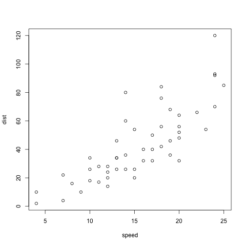

test
========================================================
author: Mark Deegan
date: Sat May 16 13:56:16 2015
transition: cube

First Slide
========================================================
type: section

For more details on authoring R presentations click the
**Help** button on the toolbar.

- Bullet 1
- Bullet 2
- Bullet 3

Slide With Code
========================================================
type: subsection


```
     speed           dist       
 Min.   : 4.0   Min.   :  2.00  
 1st Qu.:12.0   1st Qu.: 26.00  
 Median :15.0   Median : 36.00  
 Mean   :15.4   Mean   : 42.98  
 3rd Qu.:19.0   3rd Qu.: 56.00  
 Max.   :25.0   Max.   :120.00  
```

```
[1] 52
```

Slide With Plot
========================================================
type: section


```r
plot(cars)
```

 

Stuff Here On this Slide
========================================================
type: subsection

$x * x = x^2$

```r
x <- 2
x * x
```

```
[1] 4
```
   

More Examples Again
========================================================
type: subsection
Again more text

***

and a forumla:

$x = \frac{-b \pm \sqrt{b^2 - 4 a c}}{2 a}$
